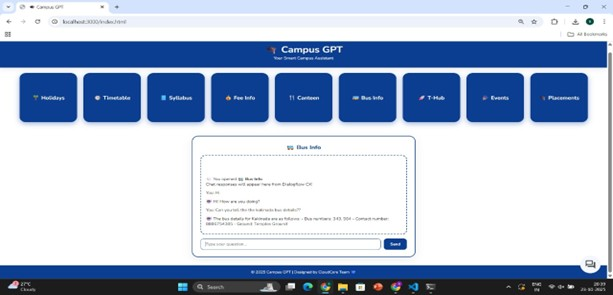

# Campus GPT — AI-Powered Campus Assistant
## Project Overview
Campus GPT is an AI-powered virtual campus assistant designed to answer questions related to college facilities, events, placements, departments, and academic processes.
The system integrates Dialogflow CX, Gemini API, and Google Cloud Storage (GCS) to deliver accurate, secure, and context-aware responses through a web-based chatbot interface.
This project emphasizes cloud architecture, AI workflow, and system design, and is fully understandable even without a live deployment.
________________________________________
## How Campus GPT Works (High-Level)
1.	Campus-related data (FAQs, events, placement information, department details) is stored in Google Cloud Storage.
2.	A Dialogflow CX agent manages conversational flow using intents, entities, and flows.
3.	A dedicated Service Account securely accesses:
o	Google Cloud Storage (to read campus data)
o	Gemini API (to generate intelligent, grounded responses)
4.	User queries are handled via:
o	Dialogflow CX Web Demo or
o	A custom frontend chatbot interface
5.	The final response is delivered to the user through the web UI.
________________________________________
## Key Features
•	Secure campus data storage using Google Cloud Storage buckets
•	AI-powered responses using Gemini API
•	Conversational AI built with Dialogflow CX
•	Web-based chatbot interface (iframe or custom UI)
•	Modular frontend–backend architecture
•	Well-documented, interview-ready system design
________________________________________
## System Architecture (Conceptual Overview)
•	Frontend: Web interface for user interaction
•	Backend: Handles API calls, webhooks, and AI orchestration
•	Dialogflow CX: Manages intents, entities, and conversation flow
•	Gemini API: Generates intelligent responses using campus context
•	Google Cloud Storage: Stores structured campus knowledge
Request Flow:
User → Frontend → Backend → Dialogflow CX → Gemini / GCS → Response → User
________________________________________
## Project Structure (Simplified)
campus-gpt/
├─ frontend/        # Chat UI (HTML, CSS, JavaScript)
├─ backend/         # API server & Dialogflow webhook
├─ gcp-config/      # Service account config (excluded from Git)
├─ docs/            # Architecture & design documentation
└─ README.md
________________________________________
## Security & Best Practices
•	Service account keys are never committed to version control
•	IAM roles follow the principle of least privilege
•	Secure HTTPS communication for all endpoints
•	API usage monitoring and cost control via GCP billing alerts
________________________________________
## Why This Project Is Important
•	Demonstrates real-world cloud-based AI system design
•	Shows practical use of conversational AI and LLM integration
•	Focuses on security, scalability, and maintainability
•	Designed to be evaluated without requiring a live deployment
________________________________________
## Future Enhancements
•	Retrieval-Augmented Generation (RAG) using embeddings
•	Analytics dashboard for user queries and failures
•	Multi-language and voice-based interaction
•	Admin interface for updating campus data
________________________________________
## Sample Screenshot & Architecture Diagrams
 
 

